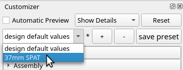
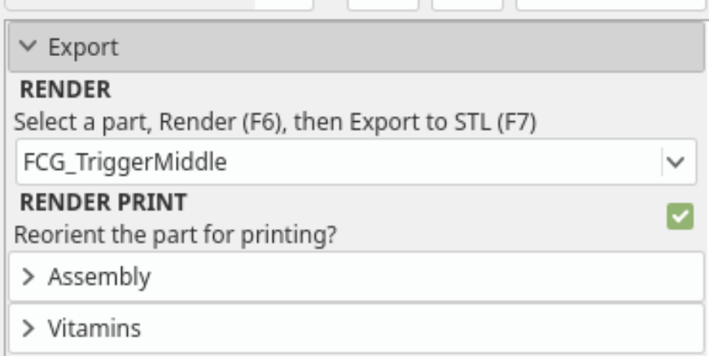
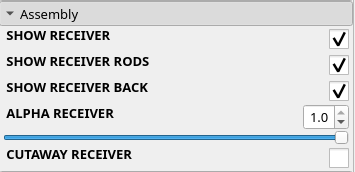
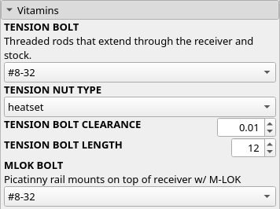
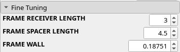
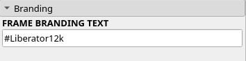

# Developers
Want to customize the designs to fit the materials you have on hand?
Change gauge or caliber completely, or something even more extreme?

The real "secret sauce" of this project, is the software library I developed
during the design process of these guns. I tried a lot of different ideas,
and what I came away with, is an OpenSCAD software library chock-full of
useful *configurable* gun parts.

If you browse through the code, you'll see the project has been grouped into
major functional areas.

  * Ammo - Printable Ammunition
  * Receiver - Lower+Universal Receiver
  * Forends - Interchangeable forends for the receiver
  * Tooling - Printable tools for gun making
  * Vitamins - Store-bought parts, nut and bolts, collars, etc.
  * Toys - Ideas I've tried and thrown away, or not.

## Requirements
If you're running Linux/Mac and have `make` available, there are Makefiles here.

### OpenSCAD
[OpenSCAD](http://www.openscad.org) is required to render printable STLs.

### Liberator12k Source Code
You will also need the complete source code ZIP for the project.
If you're reading this, you should have a copy.
Otherwise, [download the zip](https://Liberator12k.com).

## Rendering STLs
OpenSCAD has a "Customizer" pane which can be enabled from the View menu. Only
very advanced users and developers need to touch the source code - everything
else can be done with the customizer panel:

Some of the designs have other presets, like the break-action:

#### Export STL for Printing

1. Choose the part you want and push F6 to render it, or from the *Design* menu, select *Render*.
2. Once you've rendered a part for printing, you need to export the STL.
3. Push F7 or *File* -> *Export* -> *Export as STL*.
4. Save it with a unique filename based on the part name.stl

For instance:
 * ReceiverFront.stl
 * ReceiverForend.stl
 * BarrelCollar.stl
 * Extractor.stl
 * Latch.stl
 * Foregrip.stl

#### Assembly

When you preview (F5), you will see the complete assembly of all the related parts.
This section lets you show/hide parts, cutaway parts, and control transparency.

#### Vitamins

Customize the nuts, bolts, tubes, rods, etc used to render the model. This is a
great way to customize a design to your own uses/materials.

#### Fine Tuning

Allows customizing some of the parameters of a model. Useful for customizing.

#### Branding

Control the branding text by model.
