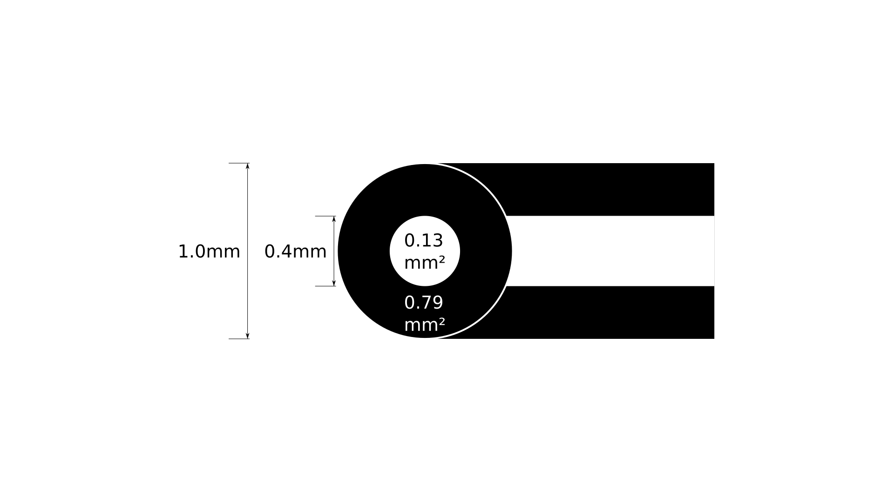

<!-- NEW PAGE -->
## Printing Guidelines
Unless otherwise stated, every print will use these settings.
Most parts are good with a thick shell and low infill.

If a part needs to be printed solid, the build guide will have a note for you.
Increase your infill to 100% for these parts.

### Compatible Materials
PLA, PLA+, ABS, PETG, Nylon, PC, POM - almost anything. 
The strength is in the steel.

Check your parts for shrinkage and scale them appropriately in your slicer if
necessary. I've been eSun PLA+ for reference size.
I often scale ABS to 100.8%, but taller layers shrink more.
Your mileage may vary.

### Print Settings
These are the only vital Cura settings to override.

**Shell**
* Wall Thickness: 3mm
* Top/Bottom Thickness: 4mm
* Filter Out Tiny Gaps: Yes *(reduces large-nozzle drool)*
* Z Seam Alignment: Sharpest Corner

**Support**
* Generate Support: Yes
* Support Structure: Tree
* Support XY Distance: 1.3mm

#### About Layer Heights
0.2mm layers are a good balance between speed and quality.

0.1mm layers will look 50% better and take twice as long.

You can *probably* print any of the large parts with layers >0.2mm high.
This is especially true with larger nozzles.
You should expect the tolerances to change because the material shrinkage will
be greater.

Smaller parts, notably the small Fire Control Group parts should be printed with
standard layer heights. Small parts usually have tighter tolerance requirements
and taller layers may cause binding. 0.1mm layers will only help here.

### \#FatNozzleGang
All print times are given for 0.4mm nozzles at 0.2mm layer height.

Increasing nozzle diameter yields exponential speed gains. Since you gain so
much speed from a larger nozzle, you can slow down your print speed and use
lower layer heights for better print quality - and *still* be faster than stock.

| Diameter | Area     | Time Factor | Effective Time |
|----------|----------|-------------|----------------|
| 0.4mm    | 0.13mm^2 | 1           | 1 day          |
| 1.0mm    | 0.79mm^2 | 1/6         | 4 hours        |
 

Almost everything can be printed with a 1.5mm nozzle;
0.4mm works too - it just takes a lot longer.

#### But Seriously
You can buy a multipack of nozzles on Amazon Prime for $15.

A nozzle swap takes less than 5 minutes and will save you days of machine time.

There's a few tricks to it.
Watch some videos about how to do the swap on your machine.

