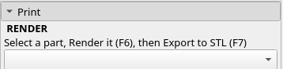

# [\#Liberator12k Manual](index.html)
## Quick Start

Welcome to the project. There's a lot of reasons you might be here. ECM, Revolver, BARBB, E-Primers, Printed Ammo - lots going on. This document is currently mostly about making a revolver or break-action.

If you're running Linux and have `make` available, there's a Makefile to do it all. Otherwise, you'll have to render the individual STLs.

### Download
[OpenSCAD](http://www.openscad.org) is required to render printable STLs.

You will also need the complete source code ZIP for the project, if you're reading this you should have a copy already. If not, download the source from [the website](https://Liberator12k.com).

### OpenSCAD in 5 minutes (STLs!)
OpenSCAD has a "Customizer" pane which can be enabled from the View menu. Only
advanced users and developers need to touch the source code - everything else
can be done with the customizer panel:

Some of the designs have other presets, like the break-action:

#### Print

Choose the part you want and push F6 to render it, or from the *Design* menu, select *Render*.
Once you've rendered a part for printing, you need to export the STL.
Push F7 or *File* -> *Export* -> *Export as STL*.
Save it with a unique filename based on the part name.stl

#### Assembly

When you preview (F5), you will see the complete assembly of all the related parts.
This section lets you show/hide parts, cutaway parts, and control transparency.

#### Vitamins

Customize the nuts, bolts, tubes, rods, etc used to render the model. This is a
great way to customize a design to your own uses/materials.

#### Fine Tuning

Allows customizing some of the parameters of a model. Useful for customizing.

#### Branding

Control the branding text by model.

## Print Settings
Designed to work in either PLA or ABS. If you try other filaments, let me know.
Bigger nozzles print *much faster*, 20x difference between 0.4mm and 1.5mm.
Almost everything prints the same: 3mm thick walls, ceilings, floors and 50% infill.

### Files to Print
* [Receiver](Receiver/Receiver.html)
* [Frame](Receiver/Frame.html)
* [Lower](Receiver/Lower/Lower.html)
* [LowerMount](Receiver/Lower/LowerMount.html)
* [Trigger](Receiver/Lower/Trigger.html)